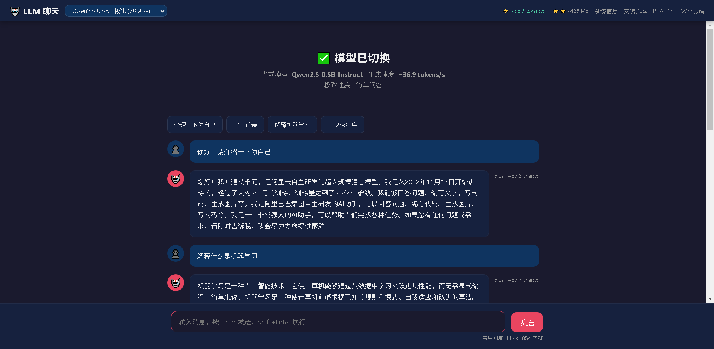

# 🦙 LLM 本地部署方案 (llama.cpp + Qwen2.5)


基于 [llama.cpp](https://github.com/ggerganov/llama.cpp) 的**纯 CPU** 大语言模型本地部署方案，支持 ARM64 / x86_64，自带 Web 聊天界面，并可通过 Cloudflare 隧道获得公网 HTTPS 地址。

> 🎯 **典型场景**：没有 GPU、没有公网 IP 的容器 / 云主机（如华为云 AI Shell、临时 K8s Pod、内网服务器）想跑一个能对外访问的中文聊天机器人。
> 实测机型：HiSilicon Kunpeng 920 · 4 vCPU · 7.2 GB 内存 · aarch64 · 0 GPU。



## ✨ 功能特性

- **一键安装**：自动检测硬件、编译、下载模型、启动服务
- **CPU 推理**：无需 GPU，支持 ARM NEON/SVE/DotProd 指令集优化
- **智能选型**：根据可用内存自动选择默认模型
- **在线切换**：Web 界面下拉菜单切换 3B/1.5B/0.5B，自动应用最优参数
- **Web 聊天**：内置美观的聊天界面，支持流式输出
- **公网访问**：通过 Cloudflare 隧道提供 HTTPS 公网地址
- **源码下载**：Web 界面可直接下载安装脚本和 Web 服务源码
- **中文优化**：使用 Qwen2.5 系列模型，中文表现优秀

## 📋 系统要求

| 项目 | 最低要求 | 推荐 |
|------|---------|------|
| CPU | 2核 | 4核+ |
| 内存 | 2GB | 6GB+ |
| 磁盘 | 5GB | 10GB+（3 个模型约 3.6 GB + 编译产物） |
| 架构 | x86_64 / aarch64 | aarch64 (ARM优化) |
| 系统 | Linux（EulerOS / Ubuntu / Debian / CentOS 已验证） | 同左 |
| 工具 | cmake≥3.14, gcc≥7, g++, make, git, curl, python3≥3.6, bc | 同左 |
| 权限 | root（脚本写入 `/root`、`/usr/local/bin`） | 同左 |

> `bc` 缺失时脚本会自动尝试安装；Python 侧**零第三方依赖**，只用标准库。

## 🚀 快速开始

### 方式一：一行命令（推荐）

```bash
curl -fsSL https://raw.githubusercontent.com/wesoho/llama-cpp-qwen-one-click/main/install.sh | bash
```

国内网络若拉取不畅，改用 jsDelivr CDN：

```bash
curl -fsSL https://cdn.jsdelivr.net/gh/wesoho/llama-cpp-qwen-one-click@main/install.sh | bash
```

### 方式二：手动下载运行

```bash
curl -O https://raw.githubusercontent.com/wesoho/llama-cpp-qwen-one-click/main/install.sh
curl -O https://raw.githubusercontent.com/wesoho/llama-cpp-qwen-one-click/main/llm_web_service.py
chmod +x install.sh
./install.sh
```

> ⏱ 首次运行耗时较长：编译 llama.cpp 约 5–15 分钟，下载 3 个模型约 3.6 GB。

脚本会自动完成以下步骤：
1. 检测硬件环境（CPU核心、内存、架构、GPU）
2. 编译 llama.cpp（含 ARM 原生优化）
3. 下载全部 3 个 Qwen2.5 模型（3B/1.5B/0.5B，支持在线切换）
4. 优化推理参数并测试速度
5. 启动 llama-server API 服务（3B 自动启用 KV 缓存量化）
6. 启动 Web 聊天界面
7. 启动 Cloudflare 隧道（公网 HTTPS 访问）

### 手动安装

如果不使用一键脚本，可以分步执行：

```bash
# 1. 安装依赖
yum install -y cmake gcc gcc-c++ make git curl python3 bc  # CentOS/RHEL
# 或
apt-get install -y cmake gcc g++ make git curl python3 bc   # Ubuntu/Debian

# 2. 克隆并编译 llama.cpp
git clone https://github.com/ggerganov/llama.cpp.git
cd llama.cpp
mkdir build && cd build
cmake .. -DCMAKE_BUILD_TYPE=Release -DGGML_NATIVE=ON \
    -DCMAKE_C_FLAGS="-march=native" -DCMAKE_CXX_FLAGS="-march=native"
make -j$(nproc) llama-server llama-cli llama-bench

# 3. 下载全部 3 个模型（支持 Web 界面在线切换）
mkdir -p ~/models
# 3B 模型 (2.0GB) — 质量优先
curl -fSL -o ~/models/qwen2.5-3b-instruct-q4_k_m.gguf \
    https://hf-mirror.com/Qwen/Qwen2.5-3B-Instruct-GGUF/resolve/main/qwen2.5-3b-instruct-q4_k_m.gguf
# 1.5B 模型 (1.1GB) — 速度/质量平衡，推荐
curl -fSL -o ~/models/qwen2.5-1.5b-instruct-q4_k_m.gguf \
    https://hf-mirror.com/Qwen/Qwen2.5-1.5B-Instruct-GGUF/resolve/main/qwen2.5-1.5b-instruct-q4_k_m.gguf
# 0.5B 模型 (469MB) — 极致速度
curl -fSL -o ~/models/qwen2.5-0.5b-instruct-q4_k_m.gguf \
    https://hf-mirror.com/Qwen/Qwen2.5-0.5B-Instruct-GGUF/resolve/main/qwen2.5-0.5b-instruct-q4_k_m.gguf

# 4. 启动 API 服务（3B 模型建议加 KV 缓存量化）
./llama.cpp/build/bin/llama-server \
    -m ~/models/qwen2.5-3b-instruct-q4_k_m.gguf \
    -t 3 -tb 4 -b 512 -c 2048 -ngl 0 \
    -ctk q4_0 -ctv q4_0 \
    --host 0.0.0.0 --port 8080

# 5. 启动 Web 服务
python3 llm_web_service.py  # 默认端口 8899

# 6. 启动 Cloudflare 隧道
cloudflared tunnel --url http://localhost:8899
```

## 🧠 模型选择

脚本根据可用内存自动选择模型，也可手动指定：

| 可用内存 | 默认模型 | 大小 | 生成速度 | 说明 |
|---------|---------|------|:---:|------|
| > 3 GB | Qwen2.5-3B-Instruct | 2.0 GB | ~7.5 t/s | 质量优先（KV缓存量化） |
| > 1.5 GB | Qwen2.5-1.5B-Instruct | 1.1 GB | ~14.5 t/s | ⭐ 速度/质量平衡，推荐 |
| ≤ 1.5 GB | Qwen2.5-0.5B-Instruct | 469 MB | ~36.9 t/s | 极致速度，简单问答 |

> 💡 脚本会下载全部 3 个模型，Web 界面可随时在线切换，无需重新安装。

所有模型使用 **Q4_K_M** 量化格式，在质量和速度之间取得良好平衡。

### 模型质量对比

同一问题"用中文简要介绍人工智能的三个主要应用领域"的回答对比：

| 模型 | 回答示例 | 质量评级 |
|------|---------|:---:|
| **3B** | 医疗健康（疾病诊断）、自动驾驶（环境感知决策）、金融科技（风险评估）三个领域各有展开 | ⭐⭐⭐ |
| **1.5B** | 图像识别、自然语言处理、智能决策，简洁正确 | ⭐⭐ |
| **0.5B** | 机器学习、自然语言处理、机器人技术，结构清晰但内容较浅 | ⭐⭐ |

## ⚡ 性能优化

### 推理参数说明

| 参数 | 说明 | 推荐值 |
|------|------|--------|
| `-t` | 生成线程数 | CPU核心数-1 |
| `-tb` | 批处理线程数 | CPU核心数 |
| `-b` | 批处理大小 | 512 |
| `-c` | 上下文长度 | 2048 |
| `-ngl` | GPU层数 | 0 (CPU推理) |
| `-ctk q4_0 -ctv q4_0` | KV缓存量化 | 3B模型推荐，生成提速44% |
| `-fa on` | Flash Attention | 此CPU上不建议，反而降速 |

### KV 缓存量化

对 3B 模型，KV 缓存量化可显著提升生成速度：

```bash
# KV缓存 q4_0 — 生成速度从 5.23 提升到 7.51 t/s (+44%)
llama-server -m model.gguf -t 3 -ctk q4_0 -ctv q4_0

# KV缓存 q8_0 — 平衡方案，生成 6.40 t/s (+22%)
llama-server -m model.gguf -t 3 -ctk q8_0 -ctv q8_0
```

> ⚠️ KV 量化会降低 Prompt 处理速度，适合长对话场景（生成多于输入）。
> 1.5B/0.5B 小模型无需 KV 量化，效果不明显。

### ARM 优化

在 ARM64 (aarch64) 架构上，编译时启用以下优化：
- **NEON**：ARM SIMD 向量指令
- **SVE**：可伸缩向量引擎
- **DotProd**：点积指令（加速矩阵乘法）
- **i8mm**：INT8 矩阵乘法指令
- **BF16**：BFloat16 支持

编译参数：`-march=native -mtune=native`

### 性能参考

以下为在 **HiSilicon Kunpeng 4核 2.9GHz (aarch64)** 上的实测结果（llama-bench, pp=128, tg=128）：

#### 不同模型对比（t=3 线程，Q4_K_M 量化）

| 模型 | 大小 | 生成速度 (t/s) | Prompt处理 (t/s) | vs 3B基线 |
|------|:---:|:---:|:---:|:---:|
| Qwen2.5-3B | 2.0 GB | 5.23 | 9.25 | 1× |
| Qwen2.5-1.5B | 1.1 GB | 14.54 | 19.55 | 2.8× |
| Qwen2.5-0.5B | 469 MB | 36.87 | 55.60 | 7.1× |

#### 3B 模型优化手段对比（t=3 线程）

| 优化配置 | 生成速度 (t/s) | Prompt处理 (t/s) | 生成提速 |
|---------|:---:|:---:|:---:|
| 基线 | 5.23 | 9.25 | — |
| Flash Attention (`-fa on`) | 5.35 | 6.84 | +2% |
| KV缓存 q8_0 (`-ctk q8_0 -ctv q8_0`) | 6.40 | 6.92 | +22% |
| **KV缓存 q4_0 (`-ctk q4_0 -ctv q4_0`)** | **7.51** | 5.94 | **+44%** |
| KV q4_0 + t=4 线程 | 6.57 | 7.40 | +26% |
| FA + KV q4_0 | 4.04 | 7.19 | -23% ❌ |

#### 1.5B 模型线程数对比

| 线程数 | 生成速度 (t/s) | Prompt处理 (t/s) |
|:---:|:---:|:---:|
| t=2 | 10.72 | 14.01 |
| **t=3** | **14.54** | **19.55** |
| t=4 | 12.85 | 19.24 |

#### 推荐配置

| 需求场景 | 推荐配置 | 生成速度 | 启动命令 |
|---------|---------|:---:|------|
| 最佳质量 | 3B + KV q4_0 | 7.5 t/s | `llama-server -m 3b.gguf -t 3 -ctk q4_0 -ctv q4_0` |
| ⭐ 速度/质量平衡 | **1.5B 基线** | **14.5 t/s** | `llama-server -m 1.5b.gguf -t 3` |
| 极致速度 | 0.5B 基线 | 36.9 t/s | `llama-server -m 0.5b.gguf -t 3` |

> 💡 **关键发现**：
> - KV 缓存 q4_0 量化对 3B 模型生成速度提升最大（+44%）
> - Flash Attention 在此 ARM CPU 上反而降低性能，不建议使用
> - 1.5B 模型速度是 3B 的 2.8 倍，质量足够日常使用
> - 0.5B 模型速度是 3B 的 7 倍，适合简单问答场景
> - 线程数 t=3（物理核心数-1）为最优配置

## 🌐 Web 服务

### 聊天界面

访问 `http://localhost:8899/` 即可使用聊天界面，特性：
- **在线模型切换**：下拉菜单选择 3B/1.5B/0.5B，自动应用最优参数并重启服务
- 流式输出，实时显示生成内容
- 支持系统提示词设置
- 可调节生成参数（温度、最大token数）
- 显示推理速度统计
- 响应式设计，支持移动端

### 模型切换

Web 界面顶部下拉菜单可直接切换模型，切换时自动应用最优推理参数：

| 模型 | 自动应用参数 | 生成速度 |
|------|-------------|---------|
| 3B | `-t 3 -ctk q4_0 -ctv q4_0` (KV缓存量化) | ~7.5 t/s |
| 1.5B | `-t 3` (基线最优) | ~14.5 t/s |
| 0.5B | `-t 3` (基线最优) | ~36.9 t/s |

API 接口切换模型：
```bash
curl -X POST http://localhost:8899/switch_model \
    -H "Content-Type: application/json" \
    -d '{"model_id":"1.5b"}'
```

### API 接口

Web 服务代理所有 llama-server API 请求：

```bash
# OpenAI 兼容 API
curl http://localhost:8899/v1/chat/completions \
    -H "Content-Type: application/json" \
    -d '{
        "model": "qwen",
        "messages": [{"role": "user", "content": "你好"}],
        "max_tokens": 100,
        "stream": true
    }'

# 健康检查
curl http://localhost:8899/health

# 系统信息
curl http://localhost:8899/info
```

### 文件下载

Web 服务提供文件下载功能：
- `http://localhost:8899/download/install.sh` — 下载安装脚本
- `http://localhost:8899/download/README.md` — 下载本文档
- `http://localhost:8899/download/llm_web_service.py` — 下载 Web 服务源码

## 🔗 Cloudflare 隧道

使用 Cloudflare Quick Tunnel 提供临时公网 HTTPS 访问：

```bash
# 安装 cloudflared
curl -fSL -o /usr/local/bin/cloudflared \
    https://github.com/cloudflare/cloudflared/releases/latest/download/cloudflared-linux-arm64
chmod +x /usr/local/bin/cloudflared

# 启动隧道
cloudflared tunnel --url http://localhost:8899
```

启动后会输出类似 `https://xxx-xxx-xxx.trycloudflare.com` 的公网地址。

> ⚠️ **注意**：Quick Tunnel 的 URL 每次启动都会变化。如需固定域名，请配置 Cloudflare Named Tunnel。

## ⚠️ 部署环境注意事项

1. **公网地址每次都会变** — 使用 Cloudflare **Quick Tunnel**，每次启动分配新的 `*.trycloudflare.com` 子域。需要固定域名请改用 [Named Tunnel](https://developers.cloudflare.com/cloudflare-one/connections/connect-networks/)。
2. **服务是后台进程，重启即失效** — 主机 / 容器重启后需重新执行 `./install.sh`。
3. **临时容器会自动销毁** — 以华为云 AI Shell 为例，Beta 期间容器**断开连接满 1 小时即被销毁**，重启后是一台全新容器（编译产物和模型全部丢失，需重新跑一遍脚本）。建议：保持长连接，或用完即关。
4. **本方案不支持 GPU** — 脚本固定 `-DGGML_CUDA=OFF -ngl 0`。有 NVIDIA 显卡的机器请自行开启 CUDA 编译。
5. **不要暴露到不可信网络** — Web 服务与 llama-server 均无鉴权，任何拿到地址的人都能调用。公网隧道仅建议临时演示使用。

## 📁 仓库文件

```
llama-cpp-qwen-one-click/
├── install.sh                    # 一键安装脚本（7 步流程）
├── llm_web_service.py            # Web 服务：聊天界面 + API 代理 + 模型切换 + 文件下载
├── README.md                     # 本文档
├── LICENSE                       # MIT
└── docs/
    └── screenshot-chat.png       # 聊天界面截图
```

## 📁 部署后的文件结构

```
/root/
├── install.sh                    # 一键安装脚本
├── README.md                     # 本文档
├── llm_web_service.py            # Web 服务（聊天界面 + API代理）
├── llama.cpp/                    # llama.cpp 源码和编译产物
│   └── build/bin/
│       ├── llama-server          # API 服务
│       ├── llama-cli             # 命令行工具
│       └── llama-bench           # 基准测试工具
├── models/                       # 模型文件
│   ├── qwen2.5-3b-instruct-q4_k_m.gguf    # 3B 模型 (2.0GB)
│   ├── qwen2.5-1.5b-instruct-q4_k_m.gguf  # 1.5B 模型 (1.1GB)
│   └── qwen2.5-0.5b-instruct-q4_k_m.gguf  # 0.5B 模型 (469MB)
├── llama-server.log              # API 服务日志
├── llm_web_service.log           # Web 服务日志
└── cloudflared.log               # 隧道日志
```

## 🛠️ 服务管理

```bash
# 查看服务状态
pgrep -a llama-server
pgrep -a "python3 llm_web_service"
pgrep -a cloudflared

# 切换模型（无需重启脚本）
curl -X POST http://localhost:8899/switch_model \
    -H "Content-Type: application/json" \
    -d '{"model_id":"1.5b"}'

# 查看当前可用模型
curl http://localhost:8899/models

# 基准测试
~/llama.cpp/build/bin/llama-bench -m ~/models/qwen2.5-3b-instruct-q4_k_m.gguf -t 3 -p 128 -n 128

# 停止所有服务
pkill -f llama-server
pkill -f "python3 llm_web_service"
pkill -f cloudflared

# 重启（重新运行安装脚本即可）
./install.sh

# 查看日志
tail -f /root/llama-server.log
tail -f /root/llm_web_service.log
tail -f /root/cloudflared.log
```

## ❓ 常见问题

### Q: 模型下载很慢或失败？
A: 脚本使用 hf-mirror.com 镜像加速下载。如果仍然失败，可以手动下载：
```bash
# 使用其他镜像
curl -fSL -o ~/models/qwen2.5-3b-instruct-q4_k_m.gguf \
    https://hf-mirror.com/Qwen/Qwen2.5-3B-Instruct-GGUF/resolve/main/qwen2.5-3b-instruct-q4_k_m.gguf
```

### Q: 编译失败？
A: 确保安装了 cmake 3.14+ 和 gcc 7+：
```bash
yum install -y cmake gcc gcc-c++  # CentOS
apt-get install -y cmake gcc g++  # Ubuntu
```

### Q: 内存不足？
A: 使用更小的模型（1.5B），或减少上下文长度：
```bash
llama-server -m model.gguf -c 1024 -t 2
```

### Q: 生成速度慢？
A: 多种优化手段可用（按效果排序）：
1. **换更小模型**（最有效）：1.5B 比 3B 快 2.8 倍，0.5B 快 7 倍
2. **KV 缓存量化**：`-ctk q4_0 -ctv q4_0` 对 3B 模型生成提速 44%
3. **线程调优**：`-t` 设为物理核心数-1（4核 CPU 用 t=3）
4. **编译优化**：确保使用了 `-march=native` 启用 ARM 指令集
5. **减少上下文**：`-c 1024` 或更小

> ⚠️ Flash Attention（`-fa on`）在 ARM CPU 上可能反而降低性能，不建议使用。

### Q: 隧道 URL 变了？
A: Cloudflare Quick Tunnel 每次启动生成新 URL。如需固定地址，请使用 Named Tunnel：
```bash
cloudflared tunnel create my-tunnel
cloudflared tunnel route dns my-tunnel your-subdomain.example.com
cloudflared tunnel run my-tunnel
```

## 📜 技术栈

- [llama.cpp](https://github.com/ggerganov/llama.cpp) — GGUF 推理引擎
- [Qwen2.5](https://github.com/QwenLM/Qwen2.5) — 通义千问大语言模型
- [Cloudflare Tunnel](https://developers.cloudflare.com/cloudflare-one/connections/connect-networks/) — 免费公网隧道
- Python 标准库 — Web 服务（无额外依赖）

## 🧹 完全卸载

```bash
pkill -f llama-server
pkill -f llm_web_service
pkill -f cloudflared

rm -rf /root/llama.cpp /root/models
rm -f /root/install.sh /root/README.md /root/llm_web_service.py
rm -f /root/llama-server.log /root/llm_web_service.log /root/cloudflared.log
rm -f /root/llama-server.pid /root/llm_web_service.pid /root/.current_model
rm -f /usr/local/bin/cloudflared
```

## 🙏 致谢

- [ggerganov/llama.cpp](https://github.com/ggerganov/llama.cpp) — GGUF 推理引擎
- [QwenLM/Qwen2.5](https://github.com/QwenLM/Qwen2.5) — 通义千问大语言模型
- [Cloudflare Tunnel](https://developers.cloudflare.com/cloudflare-one/connections/connect-networks/) — 免费公网隧道
- [hf-mirror.com](https://hf-mirror.com) — HuggingFace 国内镜像

## 📄 许可证

本仓库代码（`install.sh` / `llm_web_service.py`）采用 **MIT License**，详见 [LICENSE](./LICENSE)。

第三方组件许可：

| 组件 | 许可证 |
|------|--------|
| [llama.cpp](https://github.com/ggerganov/llama.cpp) | MIT |
| [Qwen2.5 模型权重](https://huggingface.co/Qwen) | Apache 2.0 |
| [cloudflared](https://github.com/cloudflare/cloudflared) | Apache 2.0（二进制，非本仓库产物） |

## ⚖️ 免责声明

本项目仅为便利工具。模型权重来自 HuggingFace / Qwen 官方，使用时请遵守其许可协议；公网隧道需遵守 [Cloudflare 服务条款](https://www.cloudflare.com/terms/)。作者不对因使用本项目导致的账号封禁、流量费用、数据泄露或服务中断承担责任。
